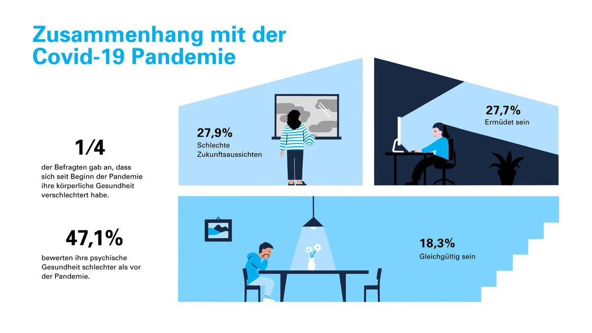
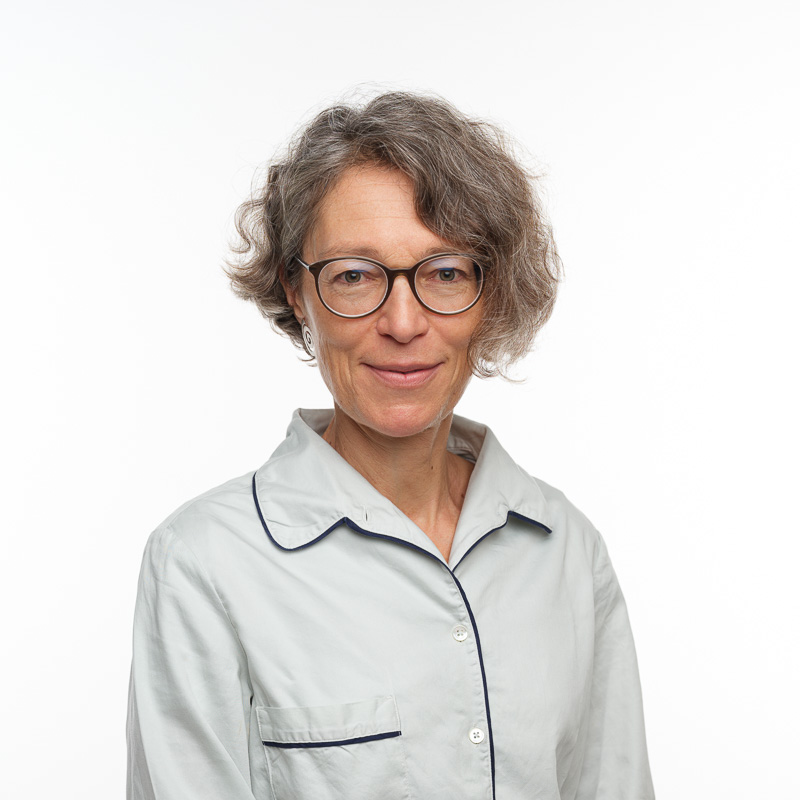

+++
title = "Faul oder krank? – Was ist mit den Schülern und Schülerinnen von heute los?"
date = "2024-05-08"
draft = false
pinned = false
tags = ["Deutsch", "Reportage"]
description = ""
footnotes = "**Quellen:**\n\n<https://www.unicef.ch/de/unsere-arbeit/schweiz-liechtenstein/psychische-gesundheit> (besucht am 3.4.24)\n\n<https://www.bfs.admin.ch/asset/de/23772011> (besucht am 3.4.24)\n\n<https://famkij.ch/verena-amrein-zuercher/> (besucht am 22.4.24)\n\n<https://www.upd.ch/de/ueber-uns/> (besucht am 22.4.24) \n\nInterview mit Frau Amrein-Zürcher (geführt am 26.3.24)\n\nInterview mit Laura K.* (geführt am 3.4.24)\n\nInterview mit Marie S.* (geführt am 5.4.24)\n\n**Abbildung 1** <https://www.unicef.ch/de/unsere-arbeit/schweiz-liechtenstein/psychische-gesundheit> (besucht am 18.04.24)\n\n**Abbildung 2** <https://famkij.ch/verena-amrein-zuercher/> (besucht am 18.04.24)\n\n**Abbildung 3** <https://www.bernerzeitung.ch/upd-bern-mit-mehr-patienten-im-corona-jahr-2020-630660220949> (besucht am 22.04.23)"
+++
**Irini Gayed, Aline Bouquet**

«Es ist schon manchmal Bedenken im Raum wie entwickeln sich diese jugendlichen Kinder dann weiter ins Erwachsenenalter. Wie gut kommen sie später klar?» so Dr. med. Verena Amrein-Zürcher, Fachärztin FMH für Kinder- und Jugendpsychiatrie und -psychotherapie, auf die Frage, wie sie die Zukunft der Betroffenen sieht, als wir sie in ihrem gemütlich eingerichteten Haus in einem ruhigen Quartier in Bern besuchen. Grund zu solch einer Aussage hat sie allemal, denn psychische Krankheiten entstehen oft im jungen Alter; viele Betroffene haben schlechte Kindheitserfahrungen gemacht. 

Als wir mit ihr an ihrem Küchentisch ein Gespräch führen und die Stimmung sehr angenehm ist, erklärt sie uns ebenfalls, dass es schwierig sei, diese Problematik auf einen Grund zurückzuführen, denn es sei ein Zusammenspiel von vielen Faktoren wie beispielsweise soziale Medien, gesellschaftlicher Leistungsdruck oder Mobbing. Dies bestätigt auch eine Studie von Unicef-Schweiz, in welcher es heisst: «Die grössten Risikofaktoren, welche die Studie in der Schweiz und Liechtenstein identifizieren konnte, sind schwierige Familienverhältnisse, ein tiefer sozioökonomischer Status, schlechte Kindheitserfahrungen sowie chronische Leiden».

##  

## Zusammenhang mit der Covid-Pandemie

Zudem entpuppte sich laut Unicef-Schweiz die Covid-Pandemie als möglicher Treiber zu schlechter psychischer Gesundheit. Laut Dr. med. Amrein-Zürcher habe die Pandemie «das Ganze noch beschleunigt», zwar habe man schon gesehen, dass die Zahlen damals hochgegangen seien, aber man könne den Anstieg der Erkrankungen nicht nur darauf zurückführen: «Jetzt kann man nicht einfach mehr sagen, ja es ist wegen Covid, das hat einen Peak gegeben, aber es hört nicht auf, sondern es geht einfach immer weiter und weiter nach oben», erläutert Dr. med. Amrein-Zürcher weiter. 

Auch bei einer Studie der Unicef-Schweiz kamen weitere erschreckende Zahlen zum Vorschein, nämlich stellte sich heraus, dass von den 1097 Teilnehmenden aus der Schweiz und aus Liechtenstein im Alter zwischen 14 und 19 Jahren, 37 Prozent von psychischen Krankheiten betroffen sind. Von allen Befragten gaben 17 Prozent der Jugendlichen, welche Anzeichen von Angststörungen und/oder Depressionen aufweisen, an, versucht zu haben, sich das Leben zu nehmen, rund 48 Prozent davon haben mehrere Suizidversuche unternommen. Insgesamt gab jeder elfte aller Befragten an, versucht zu haben, sich das Leben zu nehmen.

Unicef-Schweiz berichtet, dass dies zudem Folgen auf das Suchtverhalten der Jugendlichen hat, wie beispielsweise Rauchen, Alkohol- oder Cannabiskonsum.

## Die Situation ist prekär, besonders für Betroffene

«Ich musste ein halbes Jahr warten, bis ich einen Platz bekommen habe», damit spricht die 18-jährige Laura K.\[[1]] den Fachpersonenmangel und die langen Wartezeiten an. Sie berichtet weiter, dass sobald man im System drinnen sei, die Wartezeiten kürzer werden und man weitergereicht werde. Wir unterhalten uns mit ihr per Telefon, da ein Treffen nicht möglich war, trotzdem bekommen wir einen Eindruck über ihre Person, ihre Erfahrungen mit dem psychotherapeutischen System der Schweiz und ihrem Weg in diesem. Laura erscheint uns sehr hilfsbereit und offen. 

«Es ist alles überlastet, ich habe täglich Anfragen, oft mehrere am Tag und ich kann vielleicht ein bis zwei Neuaufnahmen pro Monat nehmen, da kann man sich etwa vorstellen wie viele, dass da am Suchen sind.» 

\-Dr. med. Verena Amrein-Zürcher



Die Fachärztin FMH für Kinder- und Jugendpsychiatrie und -psychotherapie Dr. med. Verena Amrein-Zürcher, welche momentan in der Gruppenpraxis famkij für Familien-, Kinder- und Jugendpsychologie arbeitet, war zuvor zehn Jahre lang Oberärztin am Ambulatorium des KJPD in Solothurn.



Laura K. erzählt uns weiter, dass sie gute sowie schlechte Erfahrungen gemacht habe. «Es kommt ganz darauf an, wo man gewesen ist.» Es gebe grosse Unterschiede zwischen beispielsweise verschiedenen Standorten der UPD, die Aussenstandorte seien besser als die auf dem UPD-Gelände in Bern.

Bekannten, welche auf dem UPD-Gelände in Bern waren, habe Laura K. erfahren, dass es Momente gab, in denen Informationen nicht vertraulich behandelt wurden und zum Beispiel Eltern informiert wurden, welche nicht hätten informiert werden sollen. Auch war unsensibel und ungeschickt mit Patienten und Patientinnen umgegangen worden und aus Fachpersonenmangel und somit aus zeitlichem Stress stellte das Fachpersonal manchmal Fehldiagnosen auf. 



Die Universitären Psychiatrischen Dienste Bern (UPD) sind das Hauptzentrum für Psychiatrie und Psychotherapie im Kanton Bern. Sie bieten eine umfassende Palette psychiatrischer Versorgungen und dies an über 25 Standorten im ganzen Kanton Bern. Mit über 1'700 Mitarbeitenden decken sie die gesamte psychiatrische Versorgungskette ab, von der Früherkennung bis zur Rehabilitation und Wiedereingliederung. Jedes Jahr suchen über 12'000 Patienten und Patientinnen Unterstützung in ihren Angeboten.



Zudem sieht sie ein Problem bei betreuten Wohnheimen, denn dort arbeiten sowohl Sozialarbeiter und Sozialarbeiterin als auch Psychologen und Psychologinnen und aus ihrer Erfahrung kommen die Sozialarbeiter und Sozialarbeiterinnen ihren Aufgaben nicht gerecht, nehmen Probleme nicht ernst oder werden teilweise sogar sexuell übergriffig. «Wenn man von zuhause weggeht und es dort nicht gut ist und man an einen Ort kommt, wo es nicht besser ist oder eher schlechter ist, dann ist das auf eine Art retraumatisierend», merkt Laura K. zu der Problematik an. Teilweise arbeiteten bei einem betreuten Wohnheim Mitarbeitende, welche ihre Ausbildung zum Sozialarbeiter oder zur Sozialarbeiterin noch nicht abgeschlossen hatten, denn ohne diese hatte es zu wenige Fachpersonen. 

Das Bundesamt für Statistik schreibt, dass im Jahr 2021 die Zahl der stationären Aufenthalte psychischer Störungen und Verhaltensstörungen bei jugendlichen Frauen um 26%, bei jugendlichen Männern um 6% anstieg. Laut ihnen waren zum ersten Mal psychische Störungen die häufigste Ursache für die Hospitalisierungen von 10–24-Jährigen. Es nehmen vielerlei psychische Krankheiten zu, die Hospitalisierungen waren beispielsweise wegen depressiven Störungen, Suizidversuchen, Selbstverletzung oder Essstörungen. Fast die Hälfte der im Jahr 2021 hospitalisierten Jugendlichen war nie zuvor wegen psychischer Krankheiten in Behandlung gewesen. 

Wir fragen Laura K., was sie als Haupttreiber der steigenden psychisch erkrankten Jugendlichen sieht und auch sie sieht soziale Medien, Suchtmittel und Corona als Treiber, allerdings nimmt sie schlechte Familienverhältnisse als den grössten Problemfaktor war. Sie sagt, dass die Corona Lockdowns vielleicht auch etwas Gutes bewirkt haben, denn während dieser Zeit waren Jugendliche von den Problemen in der Familie so stark betroffen, was möglicherweise dazu führte, dass sich einige Hilfe holten, weil für sie eine Grenze überschritten wurde. 

Eine weitere von uns befragte Person schildert ähnliche Muster in dem klar überlasteten System der Psychiatrie, denn oftmals seien ihre Gefühle lediglich belächelt worden und sie fühlte sich von den für sie zuständigen Fachpersonen nicht ernst genommen. «Die Probleme werden manchmal nicht wirklich ernst genommen, ausser es kommt halt zu einem sehr kritischen Punkt», schildert Marie S.\[[2]](applewebdata://5D64C5DE-4F7B-4301-BD34-B916E5A1E8D9#_ftn2) Wir trafen Marie S. vor einem Kaffee mitten in der Berner Innenstadt, trotz des allgegenwärtigen Stadtlärms konnten wir ein schönes Gespräch mit ihr führen, bei welchem sie uns erst auf ihrem Leidensweg, später dann auf dem Weg der Besserung mitnahm und uns somit einen Einblick in ihre persönlichen Erfahrungen mit dem Umgang psychischer Krankheiten bot. So berichtet auch Marie S. von langen Wartezeiten, dies sei auch schon vor zehn Jahren, als sie sich erstmalig Hilfe holte, so gewesen, besonders in der Kinder- und Jugendpsychiatrie sei es schwierig an Plätze zu kommen, denn viele Psychotherapeuten sowie Psychiater und Psychiaterinnen würden oftmals nur Patienten und Patientinnen ab einem bestimmten Alter behandeln. Die Einschätzung, dass, wenn man einmal Teil des Systems sei, es immer einfacher werde neue Ansprechpersonen zu finden, teilt sie.

Ausserdem erfahren wir von Marie S., dass sie mit der Hilfe, die ihr die Psychiatrie sowohl ambulant als auch stationär zur Verfügung, stellte grundsätzlich zufrieden ist, jedoch merkte auch sie die Überlastung und teils nicht oder nicht genügend ausgebildetes Personal: «Es war nicht immer alles perfekt und sie wussten nicht immer wie reagieren und handeln, aber im Grossen und Ganzen fand ich die Hilfe schon gut.» Ebenfalls erzählt sie uns, dass die Motivation des Personals für sie einen grossen Unterschied macht, so gäbe es Therapeuten und Therapeutinnen, die «ihrem Job wirklich leidenschaftlich nachgehen und einem auch wirklich helfen wollen» und solche, die «es nur als Job sehen und deswegen auch nicht wirklich mit den Patienten und Patientinnen interagieren und einfach da sind \[…] man spürt einen Unterschied, ob es jemand aus Hilfsbereitschaft macht oder es nur als Job sieht.» 

## Die Rolle der Schule

«Ich glaube es ist halt sehr unterschiedlich, wie ich das auch aus meiner Perspektive erlebe. Ich glaube es gibt da sehr viele sehr bemühte Lehrkräfte aber grundsätzlich schon, aber das ist ja nicht nur die Schule, das ist ja auch die Gesellschaft, die das fordert und viele Eltern, die das fordern», so Dr. med. Verena Amrein-Zürcher auf die Frage, ob die Schule zu viel Druck auf die Jugendlichen ausübt. Diese Unterschiede werden von unseren beiden Betroffenen Laura K. und Marie S. bestätigt, denn Laura K. berichtet von sowohl unterstützenden wie aber auch von diskriminierenden Lehrpersonen. Sie erklärt, dass die meisten Lehrkräfte von ihr unterstützend seien und nicht noch mehr unnötigen Druck ausüben, jedoch Personen in höheren Positionen, wie zum Beispiel die Abteilungsleitung, machen viel Druck wegen Absenzen.

«Wenn das die Schulleitung weiss, dann schaut sie auch, dass es den Schülern und Schülerinnen gut geht», meldet Marie S. zu diesem Punkt. Sie geht an ein anderes Gymnasium als Laura K. und macht dadurch auch eine andere Erfahrung, wie eben, dass die Schulleitung unterstützend sei und keinen zusätzlichen Druck ausübe.  

## Was nun?

Gegen Ende unserer Interviews hin fragten wir unsere Betroffenen, was sich ihrer Meinung nach ändern müsste und was sie Leuten gerne mit auf den Weg geben würden. Laura K. äussert daraufhin Bedenken mit dem gesellschaftlichen Umgang mit psychischen Krankheiten, diese seien «extrem stigmatisiert» und vieles würde nicht mehr ernstgenommen werden, denn «jeder hat ja jetzt Autismus oder sonst etwas, nein ist nicht so. \[…] Es wird teils als Trend dargestellt und jeder ist jetzt psychisch krank und das ist nicht so, es betrifft viele, leider, aber es ist nicht jeder und man sollte die Leute ernst nehmen.» Ausserdem appelliert sie psychisch Kranke nicht nur als ihre Krankheit zu sehen: «Sie haben nicht nur diese Krankheit, sondern sind auch noch eine Person dazu.» Auch Marie S. kommt auf das Stigma, das mit mentalen Krankheiten verbunden ist, zu sprechen, wichtig ist ihr ausserdem, dass wenn man merkt, dass man Hilfe braucht, man sich diese auch holt: «Es hat keinen Grund sich dafür zu schämen, wir brauchen alle an irgendeinem Punkt in unserem Leben Hilfe und es ist auch okay, wenn das von aussen kommt.»

Diese Aussagen stimmen mit der Einschätzung von Dr. med. Amrein-Zürcher überein, sie hält es nämlich für wichtig, dass man sich getraut, früh genug Hilfe zu holen, wenn man merkt, dass man sich über längere Zeit schlecht fühlt. Als präventive Massnahme solle man mehr über mentale Gesundheit lernen, dies schon früh genug, heisst im Kindergarten und an Schulen. Auch wir als Gesellschaft müssten unseren Teil dazu beitragen und vermehrt zu unseren Mitmenschen, wie auch zu uns selbst schauen: «Zu sich schauen, auch das man psychisch gesund bleibt, dass man sich nicht vernachlässigt und da achtsam bleibt, das ist wichtig.» 

- - -

\[[1]](applewebdata://5D64C5DE-4F7B-4301-BD34-B916E5A1E8D9#_ftnref1) Name der Redaktion bekannt

\[[2]](applewebdata://5D64C5DE-4F7B-4301-BD34-B916E5A1E8D9#_ftnref2) Name der Redaktion bekannt